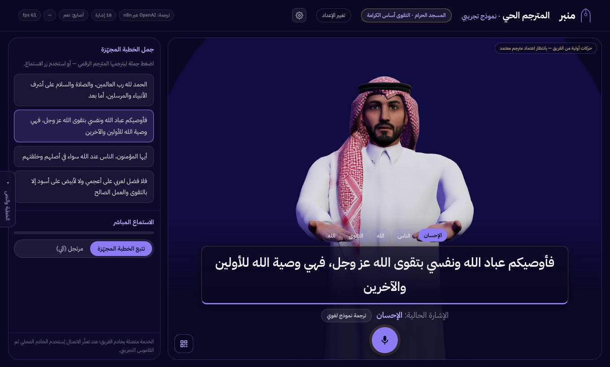
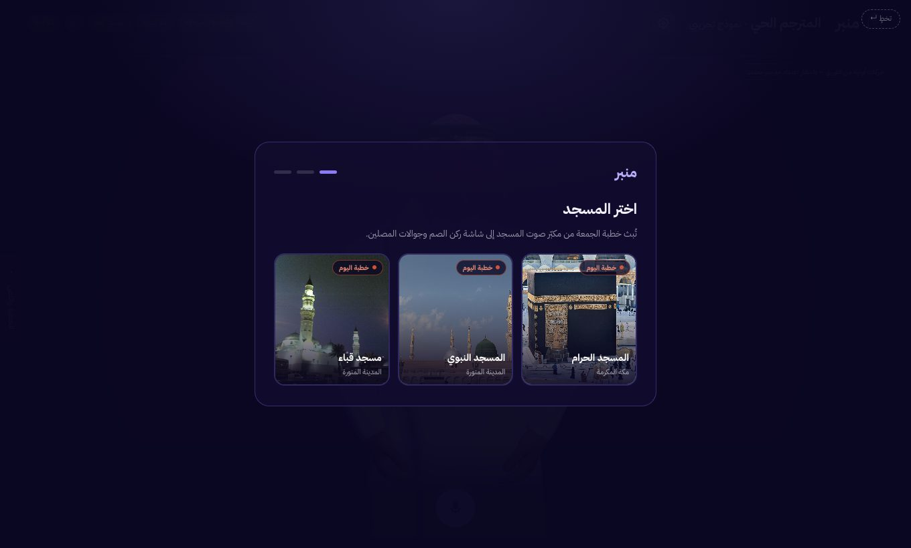
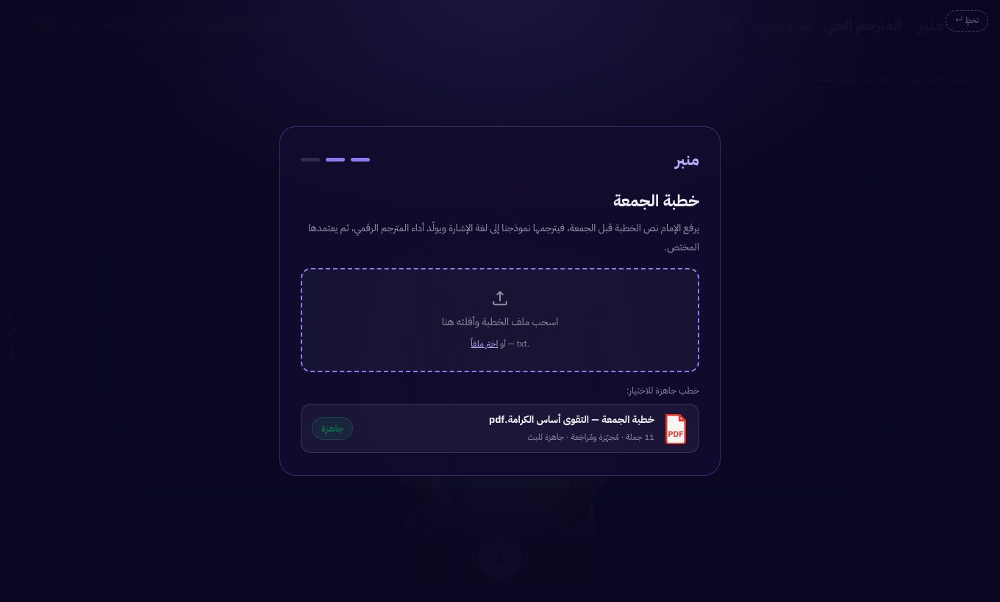
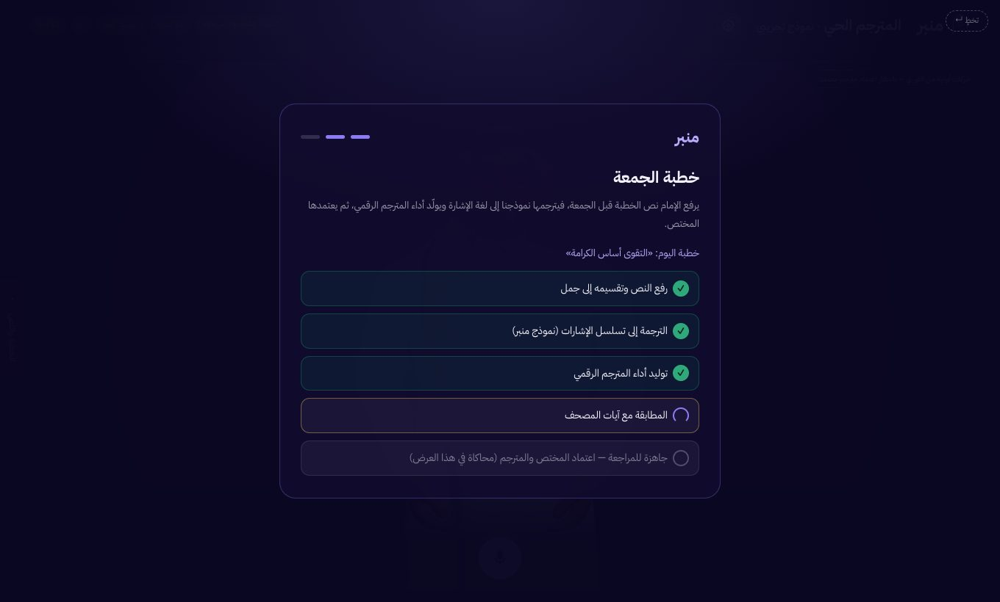
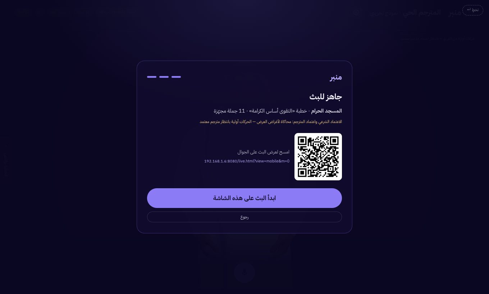
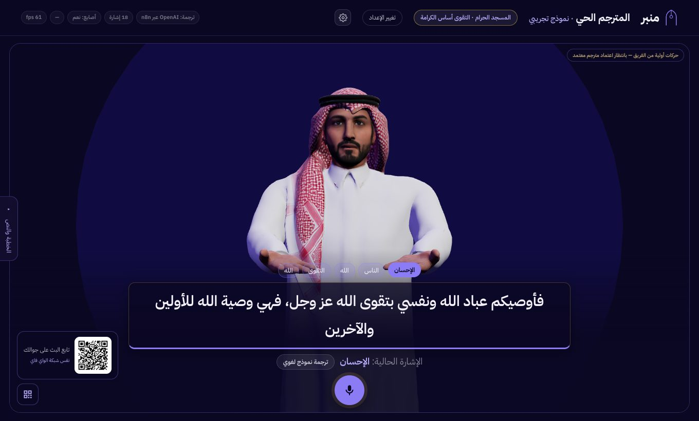
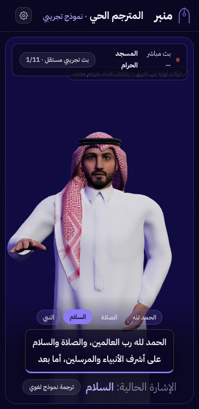
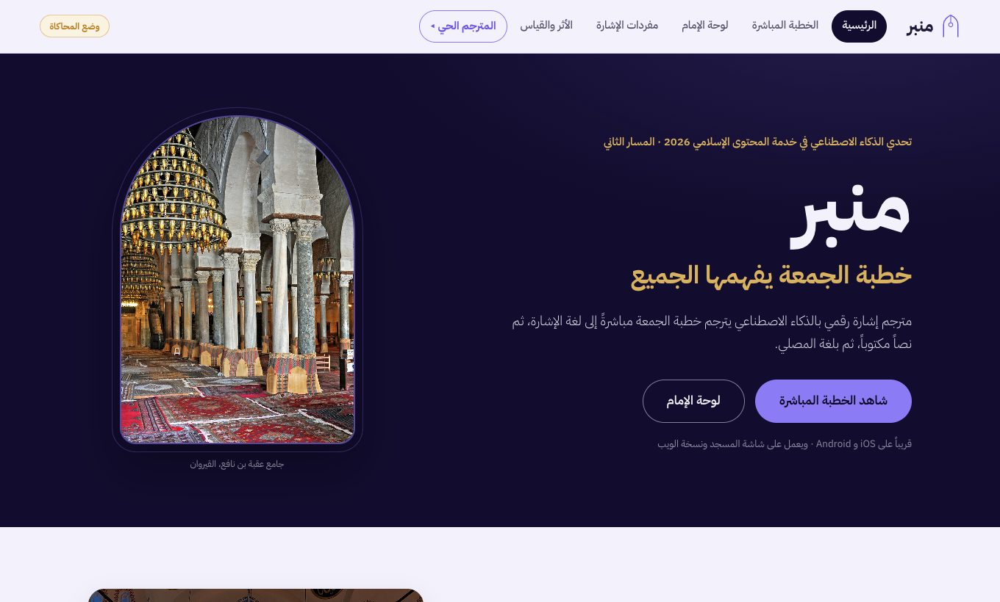

<div dir="rtl">

# منبر — Manbar

**خطبة الجمعة يفهمها الجميع.**
مترجم إشارة رقمي بالذكاء الاصطناعي: يستمع إلى صوت الإمام، يحوّله نصاً،
يترجمه إلى تسلسل إشارات، ثم تؤديه شخصية ثلاثية الأبعاد على شاشة المسجد
وجوال المصلي — مع نص مكتوب مصاحب دائماً.

مشاركة في **تحدي الذكاء الاصطناعي في خدمة المحتوى الإسلامي 2026**
(المسار الثاني — التوطين الثقافي).

**جرّبه الآن:** <https://manbar-ai.vercel.app> — يفتح على الإعداد مباشرة
(المسجد ← الخطبة ← البث)، ورمز QR فيه يعمل من أي جوال متصل بالإنترنت.
النسخة المنشورة ثابتة: الذكاء الاصطناعي عبر طبقة n8n تلقائياً، ومزامنة
الجوال اللحظية (SSE) تتطلب الخادم المحلي أدناه.



---

## رحلة الاستخدام

| | |
|---|---|
| **1 — اختيار المسجد**<br>بطاقات مصوّرة مع شارة «خطبة اليوم». |  |
| **2 — خطبة الجمعة**<br>سحب وإفلات لملف الخطبة (ملفات ‎.txt تُقسَّم جملاً فعلياً)، أو اختيار الخطبة الجاهزة بنقرة واحدة. |  |
| **3 — خط المعالجة**<br>الترجمة إلى الإشارة، توليد أداء المترجم الرقمي، مطابقة الآيات، ثم «الاعتماد» — **محاكاة مكتوبة صراحةً في هذا العرض**. |  |
| **4 — جاهز للبث**<br>ملخص الخطبة + رمز QR يفتح نسخة الجوال. |  |
| **5 — شاشة نظيفة افتراضياً**<br>الشخصية وزر التسجيل فقط؛ لوحة الجمل درجٌ جانبي قابل للطي، وQR خلف زر صغير. |  |
| **6 — جوال المصلي**<br>عبر QR: بث **متزامن مع الشاشة** (الجملة نفسها لحظياً عبر SSE من الخادم المحلي)، ومع غيابه بث تجريبي مستقل موسوم. |  |

الموقع التعريفي (المشكلة/الحل/لوحة الإمام/الأثر): `about.html` —
توقيتاته وأرقامه وإجراءات الاعتماد فيه محاكاة، وليست نتائج دراسة ميدانية.
(التطبيق الحي هو الصفحة الرئيسية `index.html`؛ المسار القديم `live.html`
يحوّل إليها تلقائياً حفاظاً على رموز QR المطبوعة.)



---

## كيف يعمل

```
صوت الإمام ← مايكروفون المتصفح
   │  تقطيع عند السكتات (VAD تكيّفي يتعلم ضجيج القاعة + مرشّح هلوسات Whisper)
   ▼
تفريغ صوتي (Whisper) ──► ترجمة إلى Gloss (GPT-4o-mini مقيّد بمعجم 18 إشارة)
   ▼                                    │
محرّك الإشارة (Three.js) ◄──────────────┘
   • نقاط مسار لليدين + حلّ Inverse Kinematics ثنائي العظام
   • محاور انحناء الأصابع مُعايَرة من الهيكل نفسه، لكل يد على حدة
   • تهجئة بالأصابع للكلمات خارج المعجم
   ▼
شاشة المسجد ──(SSE)──► جوالات المصلين المتزامنة + نص مكتوب مصاحب
```

**ثلاث طبقات للذكاء الاصطناعي** — يختار العميل أول طبقة متاحة تلقائياً:

| الطبقة | مكان المفتاح | ملاحظات |
|---|---|---|
| خدمة n8n المستضافة | على الخادم — لا مفتاح في المتصفح | الافتراضي؛ مسارات `manbar-health/gloss/asr` تحت `https://vmi3364148.contaboserver.net/webhook/` |
| خادم محلي `server.js` | `.env` | احتياط + مزامنة SSE + بث QR على الشبكة المحلية |
| وضع مباشر (متصفح ← OpenAI) | قائمة الإعدادات ⚙ | تجريبي؛ المفتاح في localStorage فقط |

بدون أي مفتاح: ترجمة بالقاموس المحلي، وWeb Speech للتعرف الصوتي حيث يتاح.
الفشل أثناء جلسة تسجيل قائمة يظهر كخطأ ولا يبدَّل المصدر في منتصفها.

---

## التشغيل خطوة بخطوة

**المتطلبات:** متصفح Chrome/Edge حديث، واتصال إنترنت (Three.js والخطوط من CDN).
للخادم المحلي: Node.js 18+.

```bash
git clone https://github.com/ilies-space/manbar-ai.git
cd manbar-ai

cp .env.example .env     # ضع OPENAI_API_KEY=... (اختياري) — لا تشارك الملف
node server.js           # ⇒ http://localhost:8080
```

1. **شاشة المسجد:** افتح `http://localhost:8080` وأكمل الإعداد:
   المسجد ← الخطبة (جرّب إسقاط ملف ‎.txt حقيقي) ← **ابدأ البث**.
2. **الجوال:** امسح رمز QR. محلياً يلزم نفس شبكة الواي فاي (اسمح لـ node في
   جدار الحماية إذا سأل) وسترى «متزامن مع شاشة المسجد»؛ على النسخة
   المنشورة يعمل من أي شبكة لكن ببث مستقل موسوم.
3. **الميكروفون:** الزر الدائري أسفل المنتصف. تكلّم بجمل قصيرة مع وقفة
   بينها؛ «تتبع الخطبة» يطابق كلامك مع الجمل المجهّزة، و«مرتجل» يترجم
   مباشرة بوسم واضح. (الميكروفون يتطلب إذن المستخدم، وHTTPS عند النشر.)
4. **الإعدادات ⚙:** رابط n8n خاص بكم أو مفتاح OpenAI للوضع المباشر.
5. **بدائل التشغيل:** واجهة فقط بلا Node؟ أي خادم ملفات ثابتة يكفي
   (`python3 -m http.server 8080`) وستعمل طبقة n8n — بلا مزامنة جوال محلية.
   محرر الإشارات: `tools/pose-editor.html`.

**الاختبارات:**

```bash
node --test tests/*.test.js
```

تتحقق من طبقات الاتصال، وبوابة الصوت، وخدمة الملفات ومنع الوصول للملفات
الخاصة — ولا تختبر صحة الترجمة الإشارية لغوياً.

الدليل الموسّع للتحكيم (استيراد سير n8n، الأمان، استكشاف الأعطال):
**[SETUP.md](SETUP.md)**

---

## تنظيم الكود

| المسار | المسؤولية |
| --- | --- |
| `server.js` | الملفات العامة، وساطة الصوت/الترجمة، مزامنة SSE للبث |
| `js/live/flow.js` | تهيئة البث (المسجد/الخطبة/QR) ونسخة الجوال |
| `js/live/asr.js` | تسجيل الصوت، VAD التكيّفي، مرشّح الهلوسات |
| `js/live/translate.js` + `api.js` | طبقات الترجمة والقاموس والذاكرة المؤقتة |
| `js/live/rig.js`, `player.js`, `scene.js` | الهيكل، محرّك الحركة (IK)، العرض |
| `assets/lexicon/` | معجم الإشارات وقوالب الأصابع والحروف |
| `tools/pose-editor.html` | أداة المترجم المعتمد لتحرير الإشارات |

---

## حدود النسخة — بصراحة

- الحركات الحالية **تجريبية من الفريق وغير معتمدة لغوياً**؛ ليست منقولة من
  تسجيلات مترجم معتمد، ولا تكفي لإثبات صحة الترجمة إلى لغة الإشارة
  السعودية. وهي موسومة بذلك على الشاشة.
- خطوة «الاعتماد» في الإعداد محاكاة مكتوبة صراحةً. أشكال حروف التهجئة
  مميّزة لكنها مبدئية حتى اعتماد المترجم.
- لم تُقَس دقة الإشارة أو الفهم مع مستخدمين صم ميدانياً بعد. مطابقة الآيات
  في المسار الحي قيد التطوير، والآيات لا تُعاد صياغتها أبداً.
- **الخطوة التالية:** حركات من تسجيلات بشرية مُصرَّح بها يراجعها مترجم
  معتمد، وندرس بيانات [Isharah](https://snalyami.github.io/Isharah_CSLR/)
  (لغة الإشارة السعودية) للربط النصي-الإشاري والتحقق الآلي — لم تُدمج ولم
  يُدرَّب عليها نموذج في هذه النسخة، ويلزم تأكيد إذن استخدامها.
- تطوير الفكرة بدأ قبل أيام التحدي وسجلات Git توثّق المراحل؛ يُفصل العمل
  السابق عن إضافات فترة المنافسة عند التقديم.

## الفريق

- **محمد زاوش** — التصميم وتجربة المستخدم
- **الياس ولد منور** — مبرمج أول · التطوير التقني

## الوسائط والتراخيص

تفاصيل المصادر والمؤلفين في [`assets/credits.json`](assets/credits.json):
صور المساجد من ويكيميديا كومنز (CC BY / CC0 / CC BY-SA)، ومقاطع الإشارة في
الموقع التعريفي مقتطفات CC0 من أبجدية لغة الإشارة الغانية — بدائل بصرية
مؤقتة وليست إشارات سعودية معتمدة. الخطوط: IBM Plex Sans Arabic وAmiri.

ترخيص نشر ملف الشخصية ثلاثية الأبعاد يحتاج توثيقاً مستقلاً؛ لا تفترض أن
تراخيص الصور تشمل الشخصية أو تمنح إعادة توزيعها.

</div>
